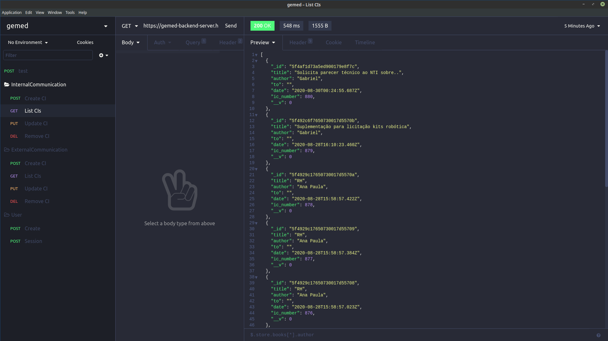
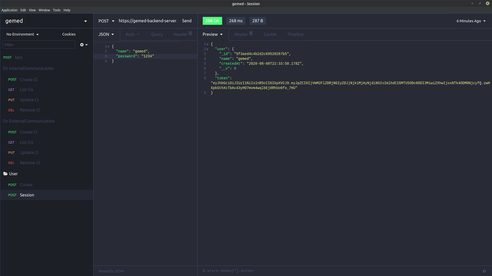

<h1 align="center">

GEMED communications (Back-end version)
</h1>

 

Application for generate ID and register communications on public relationship 

<h3 align="center">
:computer: Front-end version <a href="https://github.com/gabrielbarth/gemed-web">here</a>
</h3>

##  :mag_right:  Overview 
:us:
This application was developed using ReactJS and TypeScript. It functionalities is:

- Routes to list, create, update and remove Internal Communications;
- Routes to list, create, update and remove External Communications;
- Route to restart counting the numbers of both communications;
- Route for jwt authentication;

&#x1f1e7;&#x1f1f7;
Aplicação desenvolvida com ReactJS e TypeScript. Suas funcionalidades são:

- Rotas para listar, criar, atualizar e remover Comunicações Internas (internal-communications);
- Rotas para listar, criar, atualizar e remover Ofícios (external-communications);
- Rota para reiniciar contagem dos números de ambas comunicações;
- Rota para autenticação (jwt);

##  :desktop_computer:  Viewing on Insomnia

   

   

##  :link: Project dependencies

:heavy_check_mark: [express](https://expressjs.com/pt-br/)     `// framework that allows create nodejs applications`  
:heavy_check_mark: [bcrypt.js](https://www.npmjs.com/package/bcryptjs)     `// optimized bcrypt in JavaScript with zero dependencies`  
:heavy_check_mark: [jsonwebtoken](https://github.com/auth0/node-jsonwebtoken)     `// an implementation of JSON Web Tokens.`  
:heavy_check_mark: [mongoose](https://mongoosejs.com/docs/)     `// elegant mongodb object modeling for node.js`  
:heavy_check_mark: [mongoose-sequence](https://github.com/ramiel/mongoose-sequence)     `//plugin that lets you create fields which autoincrement their value`  

  Made with ♥ by <a href="https://gabrielbarth.com/">Gabriel Barth</a>

